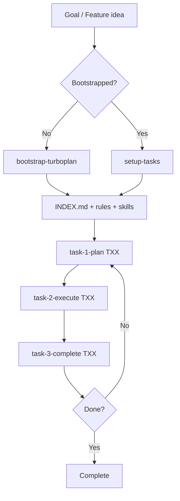
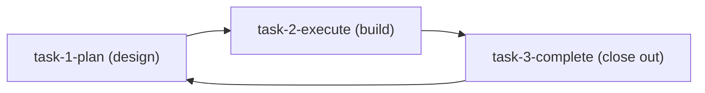

# 🧠 Turboplan methodology

  

## 🔥 The problem

Long-horizon projects fail with coding agents when:

- Rules describe a **different product** than the one being built (stale fork residue)
- Work is one giant prompt instead of **ordered, verifiable layers**
- There is no **close-out ritual** (learnings → rules, INDEX update, downstream sync)

Turboplan is a portable operating system for agents: adapt rules to the goal,
slice the goal into phases, and loop plan → execute → complete until done.

---

## 🚪 Two entry points

| When                               | Use                    | What it does                                                                                                              |
| ---------------------------------- | ---------------------- | ------------------------------------------------------------------------------------------------------------------------- |
| **New project** (greenfield)       | `/bootstrap-turboplan` | Adapts rules, creates layered phases, ships verify gate, writes README — gets you to a **ready-to-build MVP**             |
| **New feature** (existing project) | `/setup-tasks`         | Reads current rules + INDEX, proposes new phase stubs — **plans new features** without disturbing existing infrastructure |

---

## 🏛️ Three pillars

### 1. 🧭 Agent rules (hub → spoke)

One always-on hub routes agents to domain-specific spokes. No duplicated rules trees.

| Layer              | Location                     | Role                                                                                           |
| ------------------ | ---------------------------- | ---------------------------------------------------------------------------------------------- |
| Hub (always on)    | `.cursor/rules/general.mdc`  | Karpathy guidelines, routing, safety, rule maintenance, product architecture, skills inventory |
| Spokes (on demand) | `.cursor/rules/<domain>.mdc` | Failure modes and conventions for one domain (API, UI, packaging, dependency docs, …)          |
| Skills (commands)  | `.claude/skills/*/SKILL.md`  | Procedures: bootstrap, setup-tasks, plan, execute, complete, dialectic, audit                  |

- Cursor loads `.cursor/rules/*.mdc`; Claude Code loads `CLAUDE.md` → symlink to hub
- **Never** duplicate rules under `.claude/rules/`
- Bootstrap adapts rules to the specific product — deletes inapplicable spokes, creates new ones for named dependencies

### 2. 📋 Layered phases

Tasks are ordered by dependency so each layer is verifiable before the next begins.

**`planning/phases/INDEX.md`** is the single source of truth:

| Column     | Meaning                                                |
| ---------- | ------------------------------------------------------ |
| ID         | `T01` … `Tnn`                                          |
| Title      | Short name + link to stub file                         |
| Status     | `Pending` → `Planned` → `InProgress` → `✅` / `Blocked` |
| Depends-on | Prior task IDs or `—`                                  |
| Next       | Following task ID                                      |
| Layer      | Which capability layer this advances                   |

**T01** is always the skeleton bootstrap — minimal runnable program + verify gate passing.
No business logic, just the scaffold that compiles and tests green.

**Each stub file** (`TXX-name.md`) has: Description, Requirements, Acceptance Criteria,
empty Execution plan (filled by `/task-1-plan`), Test Plan, Verification, Files Modified.

### 3. 🔁 Work loop skills

| Skill                     | When                            | Recommended model                                                         | Does                                                                              |
| ------------------------- | ------------------------------- | ------------------------------------------------------------------------- | --------------------------------------------------------------------------------- |
| `/bootstrap-turboplan`    | New project                     | Large                                                                     | Goal → rules + phases + README + verify gate                                      |
| `/setup-tasks`            | New feature in existing project | Large                                                                     | Context → new phase stubs appended to INDEX                                       |
| `/task-1-plan TXX`        | Before coding                   | Medium (large only for complex tasks)                                     | Reality-check; handoff-ready plan for execute agent                               |
| `/task-2-execute TXX`     | After plan                      | Medium or small                                                           | Follow plan until AC pass; `make verify`; do not mark INDEX ✅                     |
| `/task-3-complete TXX`    | After execute                   | Medium or small                                                           | Re-verify; dialectic; INDEX → ✅; commit; push (default); Manual test; next branch |
| `/dialectic-of-cognition` | End of hard sessions            | —                                                                         | Particular → general → encode into spokes                                         |
| `/audit-rules`            | Periodically                    | —                                                                         | Read-only audit of rules/skills vs tree                                           |

> 💡 See [README: Model recommendations](README.md#model-recommendations) for which
> specific provider/models correspond to each size tier. These are **recommendations,**
> not hard rules — use the best model you have access to for the task's complexity budget.

---

## 🧠 Context gathering

Both `/bootstrap-turboplan` and `/setup-tasks` share the same context-gathering pattern.
Before building anything, the agent must extract:

1. **Goal** — what users get when done (end-user perspective, 1–3 paragraphs)
2. **Technical scope** — language, runtime, OS targets, packaging, architecture
3. **Non-goals** — explicit exclusions that prevent scope creep
4. **Dependencies** — named libraries, frameworks, external APIs (each becomes a rules spoke)
5. **References** — code or docs to study (reimplement, don't vendor)

The agent **refuses to proceed** without clear answers. A vague one-liner means the
human hasn't thought it through yet.

---

## 🔁 Running the loop

After bootstrap or `/setup-tasks` produces tasks, the work loop is (see
[README: Model recommendations](README.md#model-recommendations) for which
specific providers/models correspond to each size tier — these are recommendations):

1. **Plan** (`/task-1-plan TXX`): medium by default; switch to large only for complex
   tasks. Plan must be detailed enough that a lesser agent can execute without
   redesigning — paths, verify steps, tests, commands, pitfalls.

2. **Execute** (`/task-2-execute TXX`): medium or small. If the plan is thorough,
   medium is usually sufficient. Follow the plan exactly. Run `make verify`.
   Hard-abort if it fails.

3. **Complete** (`/task-3-complete TXX`): medium or small. The harder the execution
   was, the more dialectic learning to apply — medium when substantial patterns were
   learned, small for routine close-outs. Re-verify, run dialectic of cognition,
   mark INDEX ✅, commit, push (default; `--no-push` to skip), emit Manual test
   section, switch to next stub-stem branch.

- One task InProgress at a time unless the human says otherwise
- Work on `<stub-stem>` branches — never commit on `main`/`master`
- Blocked tasks: set Status `Blocked` with reason; human decides next step

### Task granularity heuristics

| Too big          | Too small             | Just right                                |
| ---------------- | --------------------- | ----------------------------------------- |
| "Build the app"  | "Rename one variable" | "Sanitizer maps aliases + unit tests"     |
| "All networking" | "Add one log line"    | "Tunnel supervisor + URL parse + restart" |

Each task must answer: **How do we know this layer works without the next layer?**

---

## 🌱 Rule maintenance (self-evolving)

Rules improve over time through the dialectic of cognition:

> *From the particular to the general, then from the general to the particular.*

The hub carries the full Rule Maintenance procedure (steps 0–7). Summary:

1. **Abort gate** — can you state the rule without naming a specific file/function?
2. **Particular → general** — extract the problem *class*, not the instance
3. **Encode** — symptom / cause / fix table + `<!-- last-verified: YYYY-MM -->`
4. **Verify** — would a cold-read AI recognize and apply it?
5. **Contradictions / dedupe / decay / split** — rules stay alive

Harness: `/dialectic-of-cognition` (also run from `/task-3-complete`).

---

## 🧭 Karpathy Behavioral Guidelines

Always in the hub. Four parts:

| #   | Name                  | Core idea                                               |
| --- | --------------------- | ------------------------------------------------------- |
| 1   | Think Before Coding   | State assumptions, surface tradeoffs, ask when unclear  |
| 2   | Simplicity First      | Minimum code; no speculative flexibility                |
| 3   | Surgical Changes      | Touch only what's required; clean only your own orphans |
| 4   | Goal-Driven Execution | Verifiable success criteria; step → verify loops        |

---

## 🧱 Engineering standards (internal — for Turboplan's own seed files)

These are the defaults Turboplan ships in its seeds. When bootstrapping a target
project, **replace** these with the user's actual choices — do not copy this into
the target repo.

- **Verify gate**: root `Makefile` with `verify` target (lint + test + build),
  lint config, lefthook pre-commit → verify
- **Toolchain**: latest stable for the project's language; document pins as concerns
- **Gitignore**: always `.env*` + `tmp/` + stack-specific artifacts
- **Commit policy**: `/task-3-complete` pushes by default (`--no-push` to skip);
  no commits outside that skill without explicit user request
- **Manual test**: every complete emits a Manual test section (or `Nothing to test` + why)

---

## 🚫 What Turboplan is not

- Not a replacement for human product judgment
- Not automatic commits/pushes outside `/task-3-complete`
- Not a requirement to use Docker, a specific UI framework, or a specific LLM vendor
- Not permission to rewrite unrelated repo areas

---

## ✅ Success criteria for a bootstrap

- `CLAUDE.md` → `.cursor/rules/general.mdc`
- Hub retains Karpathy Behavioral Guidelines + Rule Maintenance 0–7 + Safety / Workflow Rails
- Git repo + root `Makefile` with `verify` target + lint config + lefthook installed
- Primary language at latest stable (or pinned older version documented as concern)
- Every named dependency has a `.cursor/rules/*.mdc` spoke with docs URL
- Root `README.md` present (banner + summary + TOC + emoji headers)
- Root `.gitignore` covers secrets, `tmp/`, and stack artifacts
- Routing Map lists every spoke that exists; no leftover rules for deleted stacks
- `planning/phases/INDEX.md` has ordered tasks with Depends-on / Next
- Every INDEX row has a stub file with AC
- Skills' hard constraints match this product
- First actionable task is clear: `/task-1-plan T01`
- No product source code created (that's T01's job)
- Installer leftovers cleaned up (no `_TEMPLATE.md`, `verify-SEED/`, etc.)
