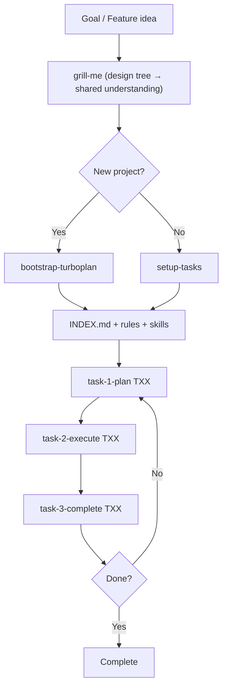
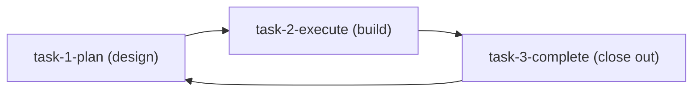

# 🧠 Turboplan methodology

<p align="center">
  
</p>

## 🔥 The problem

Long-horizon projects fail with coding agents when:

- Rules describe a **different product** than the one being built (stale fork residue)
- Work is one giant prompt instead of **ordered, verifiable layers**
- There is no **close-out ritual** (learnings → rules, INDEX update, downstream sync)

Turboplan is a portable operating system for agents: adapt rules to the goal,
slice the goal into phases, and loop plan → execute → complete until done.

---

## 🚪 Two entry points

Every idea is grilled first — `/grill-me` is the universal front-door. It is
most valuable on greenfield work, where nothing exists yet and every unspoken
assumption is still on the table.

| When                               | Use                    | What it does                                                                                                              |
| ---------------------------------- | ---------------------- | ------------------------------------------------------------------------------------------------------------------------- |
| **New project** (greenfield)       | `/grill-me` → `/bootstrap-turboplan` | `/grill-me` writes `planning/intents/F01.md` after an explicit yes; `/bootstrap-turboplan` reads it and adapts rules, phases, the verify gate, and README |
| **New feature** (existing project) | `/grill-me` → `/setup-tasks` | `/grill-me` writes the next `planning/intents/Fnn.md` after an explicit yes; `/setup-tasks` appends phase stubs for that feature id |


```mermaid
flowchart TD
    A[Goal / Feature idea] --> GR["grill-me (design tree → shared understanding)"]
    GR --> B{New project?}
    B -->|Yes| C[bootstrap-turboplan]
    B -->|No| D[setup-tasks]
    C --> E["INDEX.md + rules + skills"]
    D --> E
    E --> F["task-1-plan TXX"]
    F --> G["task-2-execute TXX"]
    G --> H["task-3-complete TXX"]
    H --> I{Done?}
    I -->|No| F
    I -->|Yes| J[Complete]
```

---

## 🏛️ Three pillars

### 1. 🧭 Agent rules (hub → spoke)

One always-on hub routes agents to domain-specific spokes. No duplicated rules trees.

| Layer              | Location                     | Role                                                                                           |
| ------------------ | ---------------------------- | ---------------------------------------------------------------------------------------------- |
| Hub (always on)    | `.cursor/rules/general.mdc`  | Karpathy guidelines, routing, safety, rule maintenance, product architecture, skills inventory |
| File spokes        | `.cursor/rules/<area>.mdc`   | Attach by glob: domain, language, dependency docs, and file-craft (security, api, ui, observability) |
| Moment spokes      | `debug.mdc`, `review.mdc`, `decisions.mdc` | No glob. A phase skill opens the file by path for that step. They are not in the hub tables. |
| Skills (commands)  | `.cursor/skills/*/SKILL.md`  | Procedures: grill-me, bootstrap, setup-tasks, plan, execute, complete, dialectic, audit           |

- Skills live in `.cursor/skills/`; Cursor loads `.cursor/rules/*.mdc` as rules and exposes skills as commands
- **Never** duplicate rules outside `.cursor/rules/`
- Bootstrap adapts rules to the specific product — deletes inapplicable file spokes and their craft-table rows, creates new ones for named dependencies, and leaves moment spokes closed until a phase skill names them
- A removal of a public surface copies `planning/spoke-seeds/deprecation.mdc` into `.cursor/rules/` and adds one craft row. Until then the seed stays out of the live rules
- Simplifying after a green test is a short section on the language spoke. A measurement step is added in `/task-1-plan` only when the quality bar names a number or the human reported slowness

### 2. 📋 Layered phases

**Tasks are ordered by dependency so each slice is verifiable before the next begins.**

The INDEX header records **Slice shape**:

- **Horizontal layers** — libraries, CLIs, infrastructure. Each layer is true before the next exists.
- **Vertical user paths** — the proof is a user action. One path through the stack, still ordered by Depends-on.

`T01` is always the skeleton. The last task is always holistic proof. Later features append rows under a new feature id (`F02`, …).

**`planning/phases/INDEX.md`** is the single source of truth:

| Column     | Meaning                                                |
| ---------- | ------------------------------------------------------ |
| ID         | `T01` … `Tnn`                                          |
| Feature    | `F01` for the initial product; `F02`, `F03`, … for later features |
| Title      | Short name + link to stub file                         |
| Status     | `Pending` → `Planned` → `InProgress` → `✅` / `Blocked` |
| Depends-on | Prior task IDs or `—`                                  |
| Next       | Following task ID                                      |
| Layer      | Which capability layer or path this advances           |

**T01** is always the skeleton bootstrap — minimal runnable program + verify gate passing.
No business logic, just the scaffold that compiles and tests green.

**Each stub file** (`TXX-name.md`) has: Description, Requirements, Acceptance Criteria,
empty Execution plan (filled by `/task-1-plan`), Test Plan, Verification, Files Modified.

### 3. 🔁 Work loop skills


```mermaid
flowchart LR
    P["task-1-plan (design)"] --> E["task-2-execute (build)"]
    E --> C["task-3-complete (close out)"]
    C --> P
```

| Skill                     | When                            | Recommended model                                                         | Does                                                                              |
| ------------------------- | ------------------------------- | ------------------------------------------------------------------------- | --------------------------------------------------------------------------------- |
| `/grill-me`               | Before `/bootstrap-turboplan` or `/setup-tasks` | Large                                                                     | Design-tree interview; explicit yes writes `planning/intents/Fnn.md` |
| `/bootstrap-turboplan`    | New project                     | Large                                                                     | Confirmed intent → rules + phases + README + verify gate |
| `/setup-tasks`            | New feature in existing project | Large                                                                     | Confirmed intent → new phase stubs appended to INDEX |
| `/task-1-plan TXX`        | Before coding                   | Medium (large only for complex tasks)                                     | Reality-check; handoff-ready plan, including commit subjects |
| `/task-2-execute TXX`     | After plan                      | Medium or small                                                           | Follow the plan; red test for behavior; local `Fnn Tnn Sn` commits; `make verify`; no push |
| `/task-3-complete TXX`    | After execute                   | Medium or small                                                           | Definition of done; dialectic; close-out commit; push (default); manual test; next branch |
| `/dialectic-of-cognition` | End of hard sessions            | —                                                                         | Particular → general → encode into spokes                                         |
| `/audit-rules`            | Periodically                    | —                                                                         | Read-only audit of rules/skills vs tree                                           |

> 💡 See [README: Model recommendations](README.md#model-recommendations) for which
> specific provider/models correspond to each size tier. These are **recommendations,**
> not hard rules — use the best model you have access to for the task's complexity budget.

### 4. 🤖 Subagent delegation

Every skill delegates facts-gathering and mechanical work to **subagents** instead
of doing it serially on the parent. The parent keeps decisions, design, and
human interaction. Use **model classes only** — never a specific model alias —
since available subagents differ per environment.

**Delegation routing:**

| Subagent class        | Purpose                                                                 | Used by                                    |
| -------------------- | ----------------------------------------------------------------------- | ------------------------------------------ |
| Explorer             | Find files, read code, trace calls, map architecture, verify facts      | grill-me, setup-tasks, bootstrap, plan     |
| Web researcher       | Fetch docs, check API references                                        | bootstrap (dep spokes), grill-me, plan     |
| Implementer          | Well-scoped feature/bugfix from a clear spec                            | execute (bounded subtasks)                 |
| Refactorer           | Extract/rename/move — behavior-preserving changes                       | execute                                    |
| Test runner          | Run tests, diagnose failures, self-heal and re-run                      | execute, complete (background)             |
| Code reviewer        | Reads `review.mdc` only; also the security spoke and checklist when the slice is irreversible or accepts untrusted input | after execute and after dialectic edits    |
| Verifier             | Skeptical independent check that claimed work is actually done          | after execute (background)                 |
| Doc writer           | Docs/changelog/README updates from diffs                                | complete, dialectic                        |
| Bash                 | Multi-step shell workflows                                              | any skill                                  |

**Rules:**

- **Facts are the subagents' job; decisions and design are the parent's.**
- **Parallelize independent work** — one subagent per independent area in a
  single batch. Don't block on a running subagent: ask what's unblocked now.
- **Background post-edit checks:** after non-trivial edits, launch code-reviewer
  and test-runner subagents in the background and continue; fold results in
  when they report.
- **Escalate on bad output:** if a subagent returns incomplete/nonsensical
  results, re-launch with tighter instructions or do it on the parent. Never
  accept silently.
- **Small tasks stay inline.** A single grep or one-file read is cheaper on the
  parent than a subagent round-trip. Over-splitting negates the win.
- If the environment has no subagent facility, every skill degrades gracefully
  to serial execution on the parent — delegation is an optimization, not a
  prerequisite.

---

## 🧠 Context gathering

Both `/bootstrap-turboplan` and `/setup-tasks` read a confirmed intent file
(`planning/intents/Fnn.md`) and refuse to invent what it does not say.
`/grill-me` writes that file after an explicit yes. The file must contain:

1. **Goal** — what users get when done (end-user perspective)
2. **Technical scope** — language, runtime, OS targets, packaging, architecture
3. **Non-goals** — explicit exclusions that prevent scope creep
4. **Dependencies** — named libraries, frameworks, external APIs (each becomes a rules spoke)
5. **References** — code or docs to study (reimplement, don't vendor)
6. **Slice shape** — horizontal layers, or vertical user paths
7. **Quality bar** — concrete tests, latency, security, or compatibility

A vague one-liner means the human hasn't thought it through yet. Send them
back to `/grill-me`.

---

## 🔥 Grilling (before planning — for any idea)

Inspired by [Matt Pocock's grill-me skill](https://www.aihero.dev/skills-grill-me).

`/grill-me` is the interrogator that runs **first** — before
`/bootstrap-turboplan` for a new project, or before `/setup-tasks` for a new
feature. It converts a rough idea into a **settled design tree** so the
planning skill starts from shared understanding instead of guesses. It pays off
everywhere, but is most valuable on **greenfield / brand-new projects**, where
nothing exists yet and every unspoken assumption is still open.

**Design tree:** every decision branches into the decisions that hang off it.
The session works the tree in **rounds**. The **frontier** is every decision
whose prerequisites are already settled — asked in one numbered round, each
question with a recommended answer (➡️). **Silence is not acceptance.** A
skipped question is asked again. Answers reshape the tree; the frontier is
recomputed each round.

The session opens with a one-sentence hypothesis and a confidence number.
Below 70%, it names what is still missing. Convention-talk (“scalable”,
“the standard approach”) is not a decision; the next question asks what they
would want if they did not have to justify it.

**Facts vs decisions:**

- **Facts are the agent's job** — schema, file paths, library capabilities,
  existing behavior. Dispatched to sub-agents, never asked of the human. A
  running exploration is just an unsettled prerequisite: only downstream
  questions wait for it. A library claim is **unverified** until its docs
  were opened this session.
- **Decisions are the human's** — every one is put to them and waited on.

**Done** = frontier empty, then a summary the human accepts with an explicit
**yes**. “Sounds good”, “whatever you think”, and silence are not yes. The
summary includes outcome, user, why now, success, constraint, out of scope,
quality bar, and slice shape (horizontal layers or vertical user paths).

That yes writes `planning/intents/Fnn.md` (`F01` for the first feature, then
`F02`, …). The turn stops. Bootstrap or `/setup-tasks` runs only in a later
turn, and it reads the file. Every settled decision lands in the INDEX and
the task stubs.

---

## 🔁 Running the loop

After bootstrap or `/setup-tasks` produces tasks, the work loop is (see
[README: Model recommendations](README.md#model-recommendations) for which
specific providers/models correspond to each size tier — these are recommendations):

1. **Plan** (`/task-1-plan TXX`): medium by default; switch to large only for complex
   tasks. Plan must be detailed enough that a lesser agent can execute without
   redesigning — paths, verify steps, tests, commands, pitfalls, and one commit
   subject per slice (`Fnn Tnn Sn One sentence.`). Behavior changes plan a
   failing test before the production edit. Irreversible steps are marked Pause.
   Split the task when the title joins two capabilities with “and”, behavior
   criteria need more than five bullets, or two independent subsystems are in play.

2. **Execute** (`/task-2-execute TXX`): medium or small. If the plan is thorough,
   medium is usually sufficient. Follow the plan exactly. For a behavior change,
   see the new test fail, then make it pass. Run `make verify` before each
   commit. Hard-abort if the verify toolchain is missing. Commit each green
   slice locally on the stub branch. Do not push. Pause for an explicit yes
   before auth changes, destructive migrations, deletions, payments, secrets,
   or anything `git revert` cannot undo. When verify fails: reproduce,
   localize, reduce, fix, and guard with a test.

3. **Complete** (`/task-3-complete TXX`): medium or small. The harder the execution
   was, the more dialectic learning to apply. Re-verify, apply the definition
   of done, run dialectic of cognition, mark INDEX ✅, commit the close-out in
   the same subject format, push (default; `--no-push` to skip), emit a manual
   test section, switch to the next stub-stem branch.

- One task InProgress at a time unless the human says otherwise
- Work on `<stub-stem>` branches — never commit on `main`/`master`
- Blocked tasks: set Status `Blocked` with reason; human decides next step

## Commit subjects

Every commit subject is one line. Three identifiers, then one sentence:

```
F01 T04 S1 Add the tunnel URL parser.
```

| Field | Form | Meaning |
| ----- | ---- | ------- |
| Feature | `F01` | Feature id. `F01` is the initial product. Later features are `F02`, `F03`, … |
| Task | `T04` | Phase task id |
| Sub-task | `S1` | Commit sequence for that task, starting at `S1`. Next integer each commit. Never zero-pad, never reuse. |
| Sentence | `Add the tunnel URL parser.` | One imperative sentence. Capital letter. One period, at the end. No `!` or `?`. No second sentence. |

Machine check:

```
^F[0-9]{2,} T[0-9]{2,} S[1-9][0-9]* [A-Z][^.!?]*\.$
```

A subject that needs “and” between two capabilities is two commits. No type
prefix, no emoji, no trailer, no `git add -A`. Stage the files the sentence
describes.

`/task-2-execute` makes these commits and does not push. `/task-3-complete`
makes the close-out commit, then pushes. `T00` is only for a bootstrap
commit the human explicitly requested: `F01 T00 S1 Seed the operating files for the project.`

Record each subject and short SHA on the task file. The installed hub’s
**Commit messages** section is the copy agents follow.

## Definition of done

Acceptance criteria answer whether this task built the right thing. The
definition of done answers whether it is finished. Close-out requires both.

The pack ships `templates/checklists/`:

- `definition-of-done.md` — standing bar (verify, runtime proof, docs, commit format)
- `security.md` — loaded for untrusted input, auth, or secrets
- `observability.md` — loaded for a long-running path; otherwise “Nothing to observe” plus why

Installed copies live at `planning/checklists/`. The hub keeps a short form
so the bar is always in context. Project-specific quality targets from the
intent file fill the hub’s quality bar. They are set once, not renegotiated
per task.

## Skill integrity

`./scripts/validate-skills.sh` checks that every skill has rationalizations,
red flags, an evidence checklist, and an under-pressure section, and that the
commit machine check is present in the hub, the work-loop skills, and these
docs. It checks structure. It does not execute a model. Run it after editing
skills. `/audit-rules`, on an installed project, checks the same headings
against the tree.

### Task granularity heuristics

| Too big          | Too small             | Just right                                |
| ---------------- | --------------------- | ----------------------------------------- |
| "Build the app" | "Rename one variable" | "Sanitizer maps aliases + unit tests" |
| "All networking" | "Add one log line" | "Tunnel supervisor restart on bad URL" |
| Two capabilities joined by "and" | | Split before planning |
| Two independent subsystems | | Two tasks, ordered by Depends-on |

Each task must answer: **How do we know this slice works without the next one?**

---

## 🌱 Rule maintenance (self-evolving)

Rules improve over time through the dialectic of cognition:

> *From the particular to the general, then from the general to the particular.*

The hub carries the full Rule Maintenance procedure (steps 0–7). Summary:

1. **Abort gate** — can you state the rule without naming a specific file/function?
2. **Particular → general** — extract the problem *class*, not the instance
3. **Encode** — symptom / cause / fix table + `<!-- last-verified: YYYY-MM -->`
4. **Verify** — would a cold-read AI recognize and apply it?
5. **Contradictions / dedupe / decay / split** — rules stay alive

Harness: `/dialectic-of-cognition` (also run from `/task-3-complete`).

---

## 🧭 Karpathy Behavioral Guidelines

Always in the hub. Four parts:

| #   | Name                  | Core idea                                               |
| --- | --------------------- | ------------------------------------------------------- |
| 1   | Think Before Coding   | State assumptions, surface tradeoffs, ask when unclear  |
| 2   | Simplicity First      | Minimum code; no speculative flexibility                |
| 3   | Surgical Changes      | Touch only what's required; clean only your own orphans |
| 4   | Goal-Driven Execution | Verifiable success criteria; step → verify loops        |

---

## 🧱 Engineering standards (internal — for Turboplan's own seed files)

These are the defaults Turboplan ships in its seeds. When bootstrapping a target
project, **replace** these with the user's actual choices — do not copy this into
the target repo.

- **Verify gate**: root `Makefile` with `verify` target (lint + test + build),
  lint config, lefthook pre-commit → verify
- **Toolchain**: latest stable for the project's language; document pins as concerns
- **Gitignore**: always `.env*` + `tmp/` + stack-specific artifacts
- **Commit policy**: `/task-2-execute` commits locally on the stub branch.
  Subjects match `Fnn Tnn Sn One sentence.` `/task-3-complete` commits the
  close-out and pushes by default (`--no-push` to skip). No commits on
  `main`/`master`. No commits outside those skills unless the human asks
  (bootstrap, if asked, uses `T00`).
- **Manual test**: every complete emits a Manual test section (or `Nothing to test` + why)
- **Definition of done**: close-out applies `planning/checklists/definition-of-done.md` in addition to the task’s acceptance criteria

---

## 🚫 What Turboplan is not

- Not a replacement for human product judgment
- Not automatic pushes outside `/task-3-complete`
- Not free-form commit subjects. The subject is `Fnn Tnn Sn One sentence.`
- Not commits on `main` or `master`
- Not a requirement to use Docker, a specific UI framework, or a specific LLM vendor
- Not permission to rewrite unrelated repo areas

---

## ✅ Success criteria for a bootstrap

- Hub retains Karpathy Behavioral Guidelines + Definition of Done + Commit messages + Irreversible steps + Rule Maintenance 0–7 + Safety / Workflow Rails
- Confirmed `planning/intents/F01.md` exists; quality bar copied into the hub
- `planning/checklists/` present (definition of done, security, observability)
- Git repo + root `Makefile` with `verify` target + lint config named in the hub + lefthook installed
- Primary language at latest stable (or pinned older version documented as concern)
- Every named dependency has a `.cursor/rules/*.mdc` spoke with a docs URL that was opened
- Root `README.md` present (banner + summary + TOC + emoji headers)
- Root `.gitignore` covers secrets, `tmp/`, and stack artifacts
- Domain Routing Map lists domain and dependency spokes; the craft table lists only file spokes that still exist; moment spokes are in neither table
- `planning/phases/INDEX.md` has ordered tasks with Feature, Depends-on, Next, and slice shape
- Every INDEX row has a stub file with acceptance criteria and a commits table
- Skills' hard constraints match this product
- First actionable task is clear: `/task-1-plan T01`
- No product source code created (that's T01's job)
- Installer leftovers cleaned up (no `_TEMPLATE.md`, `_INTENT_TEMPLATE.md`, `verify-SEED/`, etc.)
