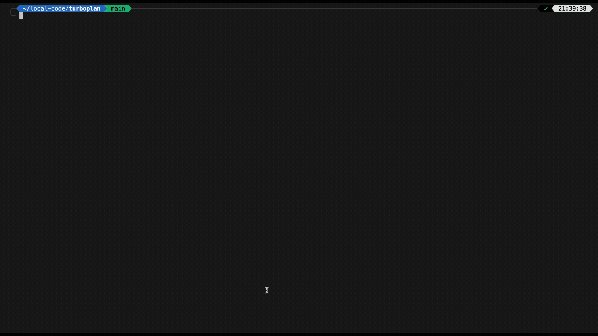
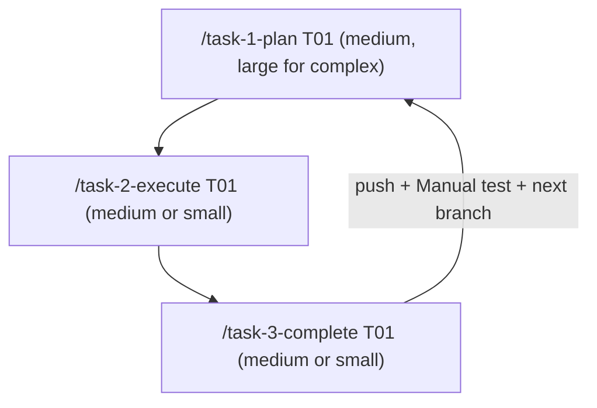
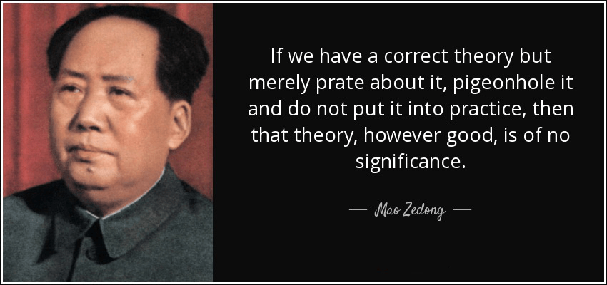

<div align="center">
  
</div>

## 🧠 Introduction <!-- omit in toc -->

**Turboplan** is a drop-in methodology pack for long-horizon software work with
coding agents (Cursor, Claude Code, or both).

Two entry points:

| When                               | Use                                                        |
| ---------------------------------- | ---------------------------------------------------------- |
| **New project** (greenfield)       | [`/bootstrap-turboplan`](METHODOLOGY.md#-two-entry-points) |
| **New feature** (existing project) | [`/setup-tasks`](METHODOLOGY.md#-two-entry-points)         |

- **One install script** — copies rules, skills, and phase templates into your repo
- **Agent gathers context** — detailed goal, technical scope, constraints (refuses without them)
- **Build in phases** — plan → execute → complete, one verifiable layer at a time
- **Evolve as you learn** — dialectic of cognition captures hard-won patterns back into the rules
- **Product-agnostic** — no sample product is bundled; adapts to your stack

> 💡 **For full methodology details, see [`METHODOLOGY.md`](METHODOLOGY.md).**

## Table of Contents <!-- omit in toc -->

- [⚡ Quickstart](#-quickstart)
- [🔁 Running the Work Loop](#-running-the-work-loop)
  - [Model split](#model-split)
- [🔌 Cursor and Claude Code Configuration](#-cursor-and-claude-code-configuration)
  - [Model recommendations](#model-recommendations)
- [🛡️ Hard Rules](#️-hard-rules)
- [🌀 Dialectic of Cognition Methodology](#-dialectic-of-cognition-methodology)
  - [📕 Influence: Mao's *On Practice* (1937)](#-influence-maos-on-practice-1937)
  - [🧰 What `/dialectic-of-cognition` does (summary)](#-what-dialectic-of-cognition-does-summary)
- [📂 Files and Directories](#-files-and-directories)

---

### 📢 Public Service Announcement: <!-- omit in toc -->

> **To avoid using and paying for 🇺🇸 AI providers like [Anthropic](https://www.scmp.com/news/china/science/article/3346519/deadly-strike-iranian-primary-school-raises-questions-about-ai-accountability), it is recommended to configure your coding agents to use alternative backends such as [DeepSeek](https://api-docs.deepseek.com/) *(most cost effective with `v4-pro` and `v4-flash`)*, [Moonshot AI](https://platform.kimi.ai/docs/api/overview) *(most intelligent with `kimi-k3`)* or [Thaura](https://thaura.ai/story) *(most ethical - made with [Tech for Palestine](https://techforpalestine.org))*.**
>
>
> 1️⃣ **Cursor** — Use [commoddity/discursive](https://github.com/commoddity/discursive)
>
> <a href="https://github.com/commoddity/discursive" target="_blank">
> <div align="left">
>   
> </div>
> </a>
>
> A custom gateway proxy that enables Cursor's full agentic and tool calling capabilities with Moonshot Kimi and/or DeepSeek.
> 
> 2️⃣ **Claude Code** — Detailed setup instructions for alternative APIs can be found in the article by [The Tricontinental](https://thetricontinental.org/)'s publication [Bandung Circuits](https://thetricontinental.org/bandung-circuits/) entitled: 
> [How to Connect Claude Code to Alternative APIs](https://thetricontinental.org/how-to-connect-claude-code-to-alternative-apis/).


## ⚡ Quickstart

One argument: the **absolute path** of the target project.

```bash
# From this pack (Mac / Linux)
./scripts/install-into.sh /absolute/path/to/YOUR_PROJECT
```

The script copies rules, skills, and phase templates, then links `CLAUDE.md` → `.cursor/rules/general.mdc`.

<p align="center">
  <br/>
  <em>Installing Turboplan</em>
</p>

Then:

1. Open `YOUR_PROJECT` in Cursor / Claude Code
2. Run `/bootstrap-turboplan` 
   
   a. The agent will ask for a detailed goal, technical scope, and constraints before building anything.
   
   b. This is your chance to outline the project's architecture, and high level goals. 
   
   c. ❕ BE THOROUGH; the input here will play a major role in the quality of the output.
3. Once it has completed, review the architecture, layer order, and README the agent produced.
4. You are now ready to run the **work loop** and begin building your project. 💫

## 🔁 Running the Work Loop

Once bootstrap is complete, enter the work loop:



For **new features** after the MVP is done, use `/setup-tasks` instead of re-running bootstrap.
It reads current rules and INDEX, then proposes new phase stubs without disturbing existing infrastructure.

Plans will be **handoff-ready** for a lesser execute agent (see hub "[Model split](METHODOLOGY.md#model-split)").
Only flag large-model execute when the task is exceptionally hard.

### Model split <!-- omit in toc -->

See [Model recommendations](#model-recommendations) for the specific providers and models
behind each size tier.

| Skill                                   | Recommended model                                                                                                     |
| --------------------------------------- | --------------------------------------------------------------------------------------------------------------------- |
| `/bootstrap-turboplan` / `/setup-tasks` | [Large](https://platform.kimi.ai/docs/guide/kimi-k3-quickstart)                                                       |
| `/task-1-plan`                          | [Medium](https://api-docs.deepseek.com/quick_start/pricing) (use [large](https://platform.kimi.ai/docs/guide/kimi-k3-quickstart) only for complex tasks) |
| `/task-2-execute`                       | [Medium](https://api-docs.deepseek.com/quick_start/pricing) or [small](https://api-docs.deepseek.com/quick_start/pricing) |
| `/task-3-complete`                      | [Medium](https://api-docs.deepseek.com/quick_start/pricing) or [small](https://api-docs.deepseek.com/quick_start/pricing) |

> 💡 **This is a recommendation, not a hard rule.** Use the largest model you have
> access to when the task warrants it; scale down when mechanical execution suffices.

> For full work loop details see [`METHODOLOGY.md#-running-the-loop`](METHODOLOGY.md#-running-the-loop).

## 🔌 Cursor and Claude Code Configuration

This workflow is intended to work equally well with **Claude Code** and/or **Cursor**. After install, a project has:

- **Rules** under `.cursor/rules/` — hub is `general.mdc`; domain spokes sit beside it. Cursor loads these as project rules.
- **Skills** under `.claude/skills/*/SKILL.md` — invocable commands (`/task-1-plan`, `/task-2-execute`, `/task-3-complete`, …) for Claude Code and Cursor Agents that support skills.
- **Root `CLAUDE.md`** — a symlink to `.cursor/rules/general.mdc`, so Claude Code reads the same hub (and its routing tables) as Cursor.

There is **no** parallel `.claude/rules/` tree. Combined with the hub's routing map, both tools share the evolving `.cursor/rules/*.mdc` files maintained by `/dialectic-of-cognition`.

### Model recommendations <!-- omit in toc -->

Where "large", "medium", and "small" appear throughout the docs, they refer to:

| Size | Provider & Model |
| ---- | ---------------- |
| **Large** | [Kimi K3](https://platform.kimi.ai/docs/guide/kimi-k3-quickstart) |
| **Medium** | [DeepSeek V4 Pro](https://api-docs.deepseek.com/quick_start/pricing) |
| **Small** | [DeepSeek V4 Flash](https://api-docs.deepseek.com/quick_start/pricing) |

> 💡 **These are recommendations, not hard rules.** Use the best model you have
> access to that fits the task's complexity budget.

---

## 🛡️ Hard Rules

- ❌ **Do not** invent a parallel `.claude/rules/` tree. Rules live only in `.cursor/rules/`. `CLAUDE.md` → symlink to `general.mdc`.
- 1️⃣ **One InProgress phase task** at a time unless the human explicitly allows more.
- ✅ **INDEX Status** uses `✅` when complete (not the word `Done` in the INDEX column).
- 🚫 Product **features** are out of scope for bootstrap; bootstrap produces rules +
  phases + skills wiring + dependency spokes from docs + human `README.md` +
  `.gitignore` + **root verify gate** (Makefile / lefthook / lint config; not the app itself).
- 🧪 Execute/complete **fail closed** if verify tooling is missing — `go test` alone is not green.
- 👥 **Rules/skills = agents; README = humans** — both evolve; keep Dependencies & docs
  and architecture narrative aligned with `.cursor/rules/` as the project grows.

---

## 🌀 Dialectic of Cognition Methodology

<p align="center">
  
</p>

### 📣 Motto <!-- omit in toc -->

> *From the particular to the general, then from the general to the particular.*

---

In agent terms:

1. **Particular → general** — A concrete bug or change (symptoms, failed attempts, docs consulted) is abstracted into a **problem class**, not a one-off anecdote.
2. **General → particular** — That class is written into the matching `.mdc` rule (symptom / cause / fix), so the next session can recognize and act without rediscovering it.
3. **Verify in practice** — A cold read of the new entry must be enough to spot the symptom and apply the fix. If not, refine until practice would confirm it.

Abort gate before encoding: *can you state the rule without naming a specific file, function, class, variable, or endpoint?* If not, there is nothing generalizable to store — the value stays in the diff.

---

### Guidelines <!-- omit in toc -->

Installed projects do not treat `.cursor/rules/` as a frozen style guide.
They treat it as a **living knowledge base** produced by working on the stack —
updated deliberately after hard sessions via `/dialectic-of-cognition` (also run
from `/task-3-complete`). Principles live in the hub
[`templates/rules/general.mdc`](templates/rules/general.mdc) → Rule Maintenance
(and the project's installed copy); the skill is only the operational harness.

The hub also carries always-on cores that dialectic does **not** replace:

1. 🧭 **Karpathy Behavioral Guidelines** — think / simplicity / surgical / goal-driven  
2. ♻️ **Rule Maintenance** — dialectic of cognition steps 0–7  
3. 🛡️ **Safety / Workflow Rails** — no-gos, verification defaults, commit/push policy  

- `/task-2-execute` and `/task-3-complete` must run `make verify` and hard-abort if verify
  tooling is missing (Makefile, lint config, lefthook pre-commit→verify). Package tests alone
  are not the gate.
- `/task-3-complete` **pushes** the completed branch by default (`--no-push` to skip) and always
  emits a **Manual test** section (or `Nothing to test` + why).
- `/bootstrap-turboplan` creates the verify gate from seed files (Makefile, lint config, lefthook),
  using latest stable toolchain versions. For Go projects, the seed Makefile includes
  `lint`, `test`, `build`, `build-all` (multi-platform), and `verify` (= lint+test+build).
  Bootstrap ships this to the project root (from `templates/seeds/verify/` →
  `planning/verify-SEED/` after install — bootstrap must still copy/adapt to
  **repo root** + `lefthook install`).

See [`METHODOLOGY.md`](METHODOLOGY.md)

---

### 📕 Influence: Mao's *On Practice* (1937)

The maintenance loop is deliberately patterned on Mao Zedong's Marxist epistemology in **"On Practice: On the Relation Between Knowledge and Practice, Between Knowing and Doing"** (July 1937) — written amid the Yan'an period, when the Chinese Communists were rebuilding strategy from lived struggle rather than importing ready-made formulas. The essay's argument is epistemological, not decorative: knowledge that never returns to practice becomes dogma; practice that never rises to theory stays a pile of anecdotes.

**Primary text:** [marxists.org — Selected Works, Vol. 1, *On Practice*](https://www.marxists.org/reference/archive/mao/selected-works/volume-1/mswv1_16.htm)

**Accessible overview:** [PolSci Institute — *On Practice*: Mao's Epistemology and Theory of Knowledge](https://polsci.institute/political-theory/mao-epistemology-theory-of-knowledge/)

Mapped onto this workflow:

| Idea from *On Practice*                                                                                     | How it shows up here                                                                                           |
| ----------------------------------------------------------------------------------------------------------- | -------------------------------------------------------------------------------------------------------------- |
| Knowledge begins in **practice** (contact with the thing); perceptual → rational                            | Hard debugging, failed attempts, and real code changes are the "perceptual" material — not invented principles |
| Rational knowledge grasps **essence / internal relations**, not isolated incidents                          | Encode a **problem class** (root-cause pattern), discard session-only noise                                    |
| Theory must **return to practice**; practice is the criterion of truth                                      | New rule entries must pass the cold-read check; stale entries decay or get struck                              |
| Oppose **dogmatism** (formulas without practice) and **empiricism** (fragmentary experience without theory) | Don't paste bookish rules that never matched this codebase; don't leave one-off fixes only in chat history     |
| *Practice, knowledge, again practice, and again knowledge* — an ascending spiral                            | Rules improve session by session; `/dialectic-of-cognition` is the deliberate turn of that spiral              |

Closing line of the essay (the spiral of cognition):

> Discover the truth through practice, and again through practice verify and develop the truth. … Practice, knowledge, again practice, and again knowledge. This form repeats itself in endless cycles, and with each cycle the content of practice and knowledge rises to a higher level.

That is the philosophical warrant for treating `.cursor/rules/` as a **material product of work on a stack** — not a static style guide dropped from outside.

### 🧰 What `/dialectic-of-cognition` does (summary)

Authority: Rule Maintenance in the installed `general.mdc`. Invoke manually after non-trivial sessions; `/task-3-complete` runs it as part of close-out.

- **Mode A** — After qualifying debugging (>5 min, docs consulted, multiple attempts, or non-obvious root cause): extract class → route via the table in `general.mdc` → encode / verify / integrity checks into **the project's** `.cursor/rules/*.mdc`.
- **Mode B** — After structural code changes: ask whether any encoded pattern is now stale, incomplete, or contradicted; refine or add only what generalizes.
- **Shared** — Prefer refining overlapping entries over proliferating duplicates; propose a human-approved split if a rule file exceeds ~600 lines (earlier if approaching ~550); timestamp `<!-- last-verified: YYYY-MM -->`; review entries older than six months when working in that domain.

If Modes A/B find nothing: *"Nothing to capture — session was routine."*

---

## 📂 Files and Directories

```
.
├── scripts/
│   └── install-into.sh ........... 🎯 One-shot installer (absolute project path)
├── METHODOLOGY.md ................ 🧠 Why this works; entry points; work loop
├── templates/
│   ├── seeds/ .................... 🌱 readme · gitignore · verify (Makefile / lefthook / golangci)
│   ├── rules/ .................... 📜 Generic `general.mdc` + example domain spoke
│   ├── skills/ ................... 🧩 Bootstrap, setup-tasks, plan, execute, complete, dialectic, audit
│   └── phases/ ................... 🗂️ INDEX.md skeleton + TXX-template.md
```
