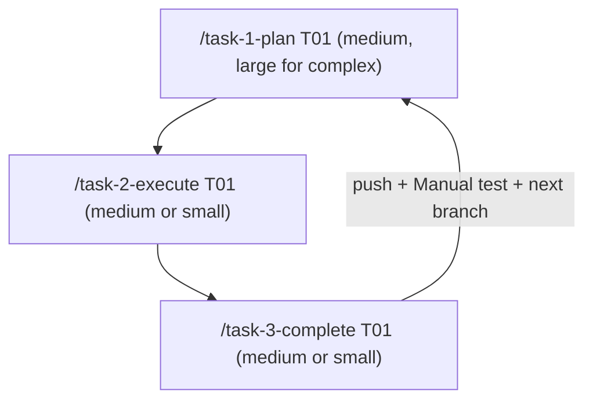

**🧠 Introduction**

**Turboplan** is a drop-in methodology pack for agentic long-horizon software work with [Cursor](https://cursor.com/docs).

It allows planning and execution of complex software engineering features using a structured methodology that captures a unique knowledge base for the specific product or codebase as it progresses.

- 📦 **One install** — copies rules, skills, and phase templates into your repo
- 🔥 **Grill first** — `/grill-me` interviews you until nothing is silently assumed
- 🎯 **Context before code** — the agent refuses to build without a goal, scope, and constraints
- 🏗️ **Build in phases** — `plan → execute → complete`, one verifiable layer at a time
- 🤖 **Subagents do the legwork** — explorers, reviewers, and verifiers work in parallel; the parent keeps design
- ♻️ **Evolve as you learn** — hard-won patterns get captured back into the rules
- 🧩 **Product-agnostic** — no sample product bundled; adapts to your stack


**📖 Methodology**

> [💡 For full methodology details, see METHODOLOGY.md](METHODOLOGY.md).

**📋 Table of Contents**

- [⚡ Quickstart](#-quickstart)
- [🔁 Running the Work Loop](#-running-the-work-loop)
- [🔌 Cursor Configuration](#-cursor-configuration)
- [🛡️ Hard Rules](#️-hard-rules)
- [🌀 Dialectic of Cognition Methodology](#-dialectic-of-cognition-methodology)
- [📂 Files and Directories](#-files-and-directories)


---


## ⚡ Quickstart

One argument: the **absolute path** of the target project.

```bash
# From this pack (Mac / Linux)
./scripts/install-into.sh /absolute/path/to/YOUR_PROJECT
```

The script copies rules, skills, and phase templates into your repo.

  
*Installing Turboplan*

Then (install only copies generic Turboplan scaffolding — `/grill-me` grills your **idea**, not product code):

1. Open `YOUR_PROJECT` in Cursor
2. Run `/grill-me` (💡 `large` model — see [Model recommendations](#model-recommendations)) — stress-tests assumptions in rounds; outputs a confirmed summary for step 3
3. Run **`/bootstrap-turboplan`** (new project) or **`/setup-tasks`** (existing project — new phases without rebuilding infrastructure)
  - 💡 `large` model — complex reasoning; pass the grill summary as context
  - ❕ BE THOROUGH — this input drives rules, phases, and README quality
4. Review the architecture, layer order, and README the agent produced
5. Enter the **work loop** and begin building 💫


## 🔁 Running the Work Loop

Once bootstrap is complete, enter the work loop:


```mermaid
flowchart TD
    P["/task-1-plan T01 (medium, large for complex)"] --> E["/task-2-execute T01 (medium or small)"]
    E --> C["/task-3-complete T01 (medium or small)"]
    C -->|"push + Manual test + next branch"| P
```


Every idea starts with the same grill: [/grill-me](METHODOLOGY.md#-grilling-between-idea-and-planning)
interrogates it in rounds over a design tree (facts via sub-agents, decisions
via the human) until a shared-understanding summary is confirmed — most
valuable on greenfield work, where nothing is settled yet. Then:

- **New project** → `/bootstrap-turboplan`, which turns the settled goal into rules + phases.
- **New feature** → `/setup-tasks`, which reads current rules and INDEX plus the
settled grilling decisions, then proposes new phase stubs without disturbing existing infrastructure.

Plans will be **handoff-ready** for a lesser execute agent (see hub "[Model split](METHODOLOGY.md#model-split)").
Only flag large-model execute when the task is exceptionally hard.


### Model split

See [Model recommendations](#model-recommendations) for the specific providers and models
behind each size tier.


| Skill                                   | Recommended model                         |
| --------------------------------------- | ----------------------------------------- |
| `/grill-me`                             | Large                                     |
| `/bootstrap-turboplan` / `/setup-tasks` | Large                                     |
| `/task-1-plan`                          | Medium or large |
| `/task-2-execute`                       | Medium or small                           |
| `/task-3-complete`                      | Medium or small                           |


> 💡 **This is a recommendation, not a hard rule.** Use the largest model you have
> access to when the task warrants it; scale down when mechanical execution suffices.

> For full work loop details see [METHODOLOGY.md#-running-the-loop](METHODOLOGY.md#-running-the-loop).
> For how skills delegate to subagents see
> `METHODOLOGY.md` [— Subagent delegation](METHODOLOGY.md#4--subagent-delegation).


## 🔌 Cursor Configuration

This workflow is built for **Cursor**. After install, a project has:

- **Rules** under `.cursor/rules/` — hub is `general.mdc`; domain spokes sit beside it. Cursor loads these as project rules.
- **Skills** under `.cursor/skills/*/SKILL.md` — invocable commands (`/grill-me`, `/task-1-plan`, `/task-2-execute`, `/task-3-complete`, …) for Cursor agents.

Combined with the hub's routing map, the evolving `.cursor/rules/*.mdc` files are maintained by `/dialectic-of-cognition`.

## 🛡️ Hard Rules

- ❌ **Do not** create rules anywhere but `.cursor/rules/`. Skills live in `.cursor/skills/`.
- 1️⃣ **One InProgress phase task** at a time unless the human explicitly allows more.
- ✅ **INDEX Status** uses `✅` when complete (not the word `Done` in the INDEX column).
- 🚫 Product **features** are out of scope for bootstrap; bootstrap produces rules +
phases + skills wiring + dependency spokes from docs + human `README.md` +
`.gitignore` + **root verify gate** (Makefile / lefthook / lint config; not the app itself).
- 🧪 Execute/complete **fail closed** if verify tooling is missing — `go test` alone is not green.
- 👥 **Rules/skills = agents; README = humans** — both evolve; keep Dependencies & docs
and architecture narrative aligned with `.cursor/rules/` as the project grows.


### 🛠️ Model recommendations


### 📢 Public Service Announcement

> If you would prefer to use alternative AI providers with Cursor, you can use [commoddity/discursive](https://github.com/commoddity/discursive).
>
> 
>
> Discursive is a custom gateway proxy that enables Cursor's full agentic and tool calling capabilities with Z.ai, DeepSeek, Moonshot and Thaura.

Where "large", "medium", and "small" appear throughout the docs, they refer to:


| Size       | Provider & Model                                                                                                                      |
| ---------- | ------------------------------------------------------------------------------------------------------------------------------------- |
| **Large**  | [GLM-5.3](https://docs.z.ai/guides/llm/glm-5.3) or [Kimi K3](https://platform.kimi.ai/docs/guide/kimi-k3-quickstart)                  |
| **Medium** | [DeepSeek V4 Pro](https://api-docs.deepseek.com/quick_start/pricing)                                                                  |
| **Small**  | [DeepSeek V4 Flash](https://api-docs.deepseek.com/quick_start/pricing) or [GLM-5.3 Flash](https://docs.z.ai/guides/llm/glm-5.3-flash) |


> 💡 **These are recommendations, not hard rules.** Use the best model you have
> access to that fits the task's complexity budget.


## 🌀 Dialectic of Cognition Methodology


### 📣 Motto

> *From the particular to the general, then from the general to the particular.*

In agent terms:

1. **Particular → general** — A concrete bug or change (symptoms, failed attempts, docs consulted) is abstracted into a **problem class**, not a one-off anecdote.
2. **General → particular** — That class is written into the matching `.mdc` rule (symptom / cause / fix), so the next session can recognize and act without rediscovering it.
3. **Verify in practice** — A cold read of the new entry must be enough to spot the symptom and apply the fix. If not, refine until practice would confirm it.

Abort gate before encoding: *can you state the rule without naming a specific file, function, class, variable, or endpoint?* If not, there is nothing generalizable to store — the value stays in the diff.


### Guidelines

Installed projects do not treat `.cursor/rules/` as a frozen style guide.
They treat it as a **living knowledge base** produced by working on the stack —
updated deliberately after hard sessions via `/dialectic-of-cognition` (also run
from `/task-3-complete`). Principles live in the hub
`[templates/rules/general.mdc](templates/rules/general.mdc)` → Rule Maintenance
(and the project's installed copy); the skill is only the operational harness.

The hub also carries always-on cores that dialectic does **not** replace:

1. 🧭 **Karpathy Behavioral Guidelines** — think / simplicity / surgical / goal-driven
2. ♻️ **Rule Maintenance** — dialectic of cognition steps 0–7
3. 🛡️ **Safety / Workflow Rails** — no-gos, verification defaults, commit/push policy

- `/task-2-execute` and `/task-3-complete` must run `make verify` and hard-abort if verify
tooling is missing (Makefile, lint config, lefthook pre-commit→verify). Package tests alone
are not the gate.
- `/task-3-complete` **pushes** the completed branch by default (`--no-push` to skip) and always
emits a **Manual test** section (or `Nothing to test` + why).
- `/bootstrap-turboplan` creates the verify gate from seed files (Makefile, lint config, lefthook),
using latest stable toolchain versions. For Go projects, the seed Makefile includes
`lint`, `test`, `build`, `build-all` (multi-platform), and `verify` (= lint+test+build).
Bootstrap ships this to the project root (from `templates/seeds/verify/` →
`planning/verify-SEED/` after install — bootstrap must still copy/adapt to
**repo root** + `lefthook install`).

See `[METHODOLOGY.md](METHODOLOGY.md)`


### 📕 Influence: *On Practice* (1937)

The maintenance loop is deliberately patterned on the famous 1937 essay **"On Practice: On the Relation Between Knowledge and Practice, Between Knowing and Doing"**. The essay's argument is epistemological, not decorative: knowledge that never returns to practice becomes dogma; practice that never rises to theory stays a pile of anecdotes.

**Overview of the text:** [PolSci Institute — *On Practice*: Epistemology and Theory of Knowledge](https://polsci.institute/political-theory/mao-epistemology-theory-of-knowledge/)

Mapped onto this workflow:


| Idea from *On Practice*                                                                                     | How it shows up here                                                                                           |
| ----------------------------------------------------------------------------------------------------------- | -------------------------------------------------------------------------------------------------------------- |
| Knowledge begins in **practice** (contact with the thing); perceptual → rational                            | Hard debugging, failed attempts, and real code changes are the "perceptual" material — not invented principles |
| Rational knowledge grasps **essence / internal relations**, not isolated incidents                          | Encode a **problem class** (root-cause pattern), discard session-only noise                                    |
| Theory must **return to practice**; practice is the criterion of truth                                      | New rule entries must pass the cold-read check; stale entries decay or get struck                              |
| Oppose **dogmatism** (formulas without practice) and **empiricism** (fragmentary experience without theory) | Don't paste bookish rules that never matched this codebase; don't leave one-off fixes only in chat history     |
| *Practice, knowledge, again practice, and again knowledge* — an ascending spiral                            | Rules improve session by session; `/dialectic-of-cognition` is the deliberate turn of that spiral              |


Closing line of the essay (the spiral of cognition):

> Discover the truth through practice, and again through practice verify and develop the truth. … Practice, knowledge, again practice, and again knowledge. This form repeats itself in endless cycles, and with each cycle the content of practice and knowledge rises to a higher level.

That is the philosophical warrant for treating `.cursor/rules/` as a **material product of work on a stack** — not a static style guide dropped from outside.


### 🧰 What `/dialectic-of-cognition` does (summary)

Authority: Rule Maintenance in the installed `general.mdc`. Invoke manually after non-trivial sessions; `/task-3-complete` runs it as part of close-out.

- **Mode A** — After qualifying debugging (>5 min, docs consulted, multiple attempts, or non-obvious root cause): extract class → route via the table in `general.mdc` → encode / verify / integrity checks into **the project's** `.cursor/rules/*.mdc`.
- **Mode B** — After structural code changes: ask whether any encoded pattern is now stale, incomplete, or contradicted; refine or add only what generalizes.
- **Shared** — Prefer refining overlapping entries over proliferating duplicates; propose a human-approved split if a rule file exceeds ~600 lines (earlier if approaching ~550); timestamp `<!-- last-verified: YYYY-MM -->`; review entries older than six months when working in that domain.

If Modes A/B find nothing: *"Nothing to capture — session was routine."*

## 📂 Files and Directories

```
.
├── scripts/
│   └── install-into.sh ........... 🎯 One-shot installer (absolute project path)
├── METHODOLOGY.md ................ 🧠 Why this works; entry points; work loop
├── templates/
│   ├── seeds/ .................... 🌱 readme · gitignore · verify (Makefile / lefthook / golangci)
│   ├── rules/ .................... 📜 Generic `general.mdc` + example domain spoke
│   ├── skills/ ................... 🧩 Grill-me, bootstrap, setup-tasks, plan, execute, complete, dialectic, audit
│   └── phases/ ................... 🗂️ INDEX.md skeleton + TXX-template.md
```

